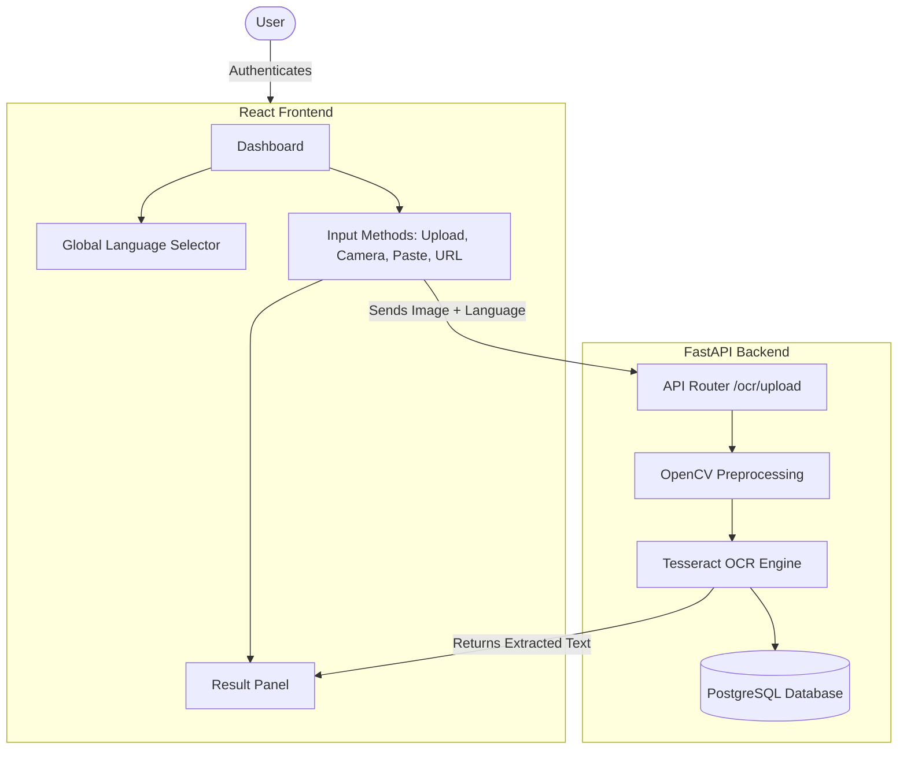

# VisionOCR: Complete Platform Overview

This document serves as a comprehensive guide to the current state of the VisionOCR application. It outlines the complete user workflow, all currently implemented features, and a roadmap of what can be added next to elevate the platform.

---

## 1. Core Workflow Architecture

Here is the high-level flow of how data moves through the VisionOCR system:

---

## 2. Currently Implemented Features

We have built a highly capable, premium full-stack application. Here is exactly what is currently working:

### Authentication & Security
- **Secure Login/Registration**: JWT-based authentication. Unauthenticated users are strictly redirected to the login page.
- **Protected Routing**: Users cannot access the Dashboard, History, or Settings without a valid session.

### Dashboard & Input Methods
- **Global Language Selector**: A dropdown at the top of the dashboard that applies to *all* input methods. It supports 20+ languages (English, Telugu, Hindi, Spanish, etc.) and mixed models (e.g., English + Telugu).
- **Drag & Drop Upload**: A premium animated upload zone for local files (JPG, PNG).
- **Scan Camera**: A custom modal that accesses the user's webcam (or phone camera) to capture live documents. *The modal explicitly displays the active language.*
- **URL Upload**: A dialog to fetch and import images directly from web URLs, bypassing the need to download them locally first. *The modal explicitly displays the active language.*
- **Paste from Clipboard**: Quick action to instantly process an image copied to the system clipboard (using `Ctrl+V` or the dashboard button).

### Processing & Output
- **OpenCV Preprocessing**: Before OCR, the backend cleans the image (grayscale, median blur, Otsu's thresholding) to maximize accuracy.
- **Tesseract Engine**: Uses localized `.traineddata` models to extract text.
- **Result Panel**: Displays the extracted text alongside confidence scores, processing time, word count, and line count.

### Data Management
- **History Page**: A searchable log of all past extractions. Includes pagination and detailed views.
- **Exports Page**: Allows users to download their past extractions in multiple formats (`.TXT` and `.PDF`).
- **Settings Page**: Users can update their profile name, email, and password. Also includes an Appearance tab to toggle Light/Dark mode globally.

---

## 3. What Needs to be Added / Future Roadmap

To make VisionOCR an enterprise-grade platform, here are the features we can implement next:

### Enhancing Accuracy & Capability
> [!TIP]
> **Advanced AI Integrations**
> Tesseract is great for basic OCR, but integrating a fallback to **OpenAI Vision**, **Google Cloud Vision**, or **EasyOCR** would drastically improve accuracy for complex handwriting or highly degraded documents.

- **Batch Processing**: Allowing users to upload 10-20 images at once and extracting text in the background.
- **Document Translation**: Once text is extracted in a foreign language (e.g., Telugu), add a button to instantly translate it to English using an external API.
- **PDF Parsing**: Currently, the system supports images. We should add support for uploading multi-page PDF documents and extracting text from every page.

### Enhancing User Experience
- **Editable Results**: Allow the user to edit the extracted text directly in the Result Panel before saving it to history (to correct minor OCR typos).
- **Rich Exports**: Add the ability to export data to Microsoft Word (`.docx`) or Excel (`.xlsx`), especially useful for tabular data extraction.
- **Document Categorization**: Allow users to create "Folders" or "Tags" (e.g., "Invoices", "Notes", "Receipts") to organize their History.

### System & Backend
- **Rate Limiting & Quotas**: If you plan to deploy this for public users, we need to add API rate limiting so users don't abuse the server resources.
- **Cloud Storage**: Currently, files are stored locally in the `backend/uploads` folder. We should migrate this to AWS S3 or Cloudinary for production deployment.
